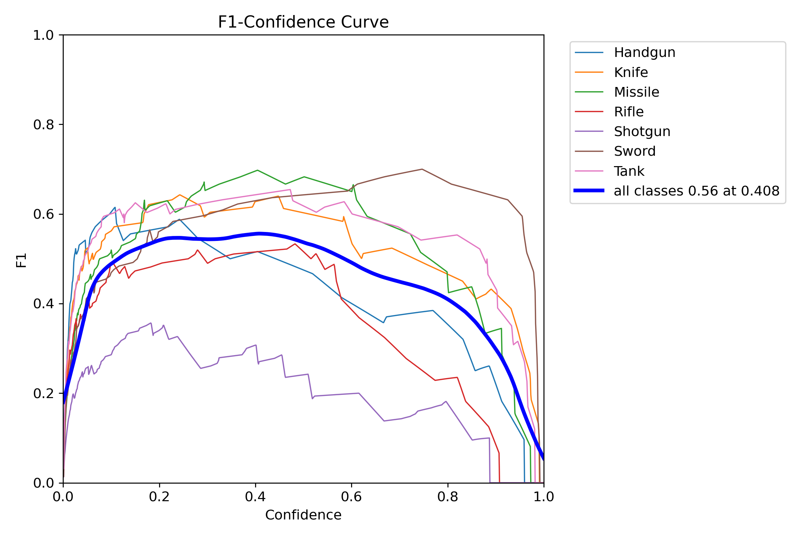
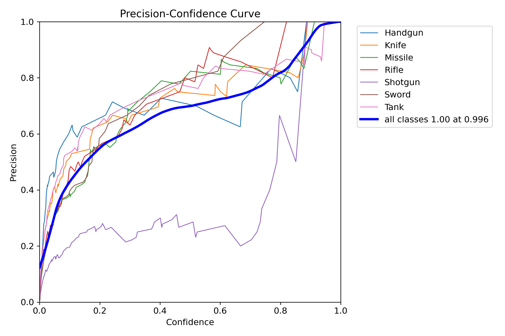
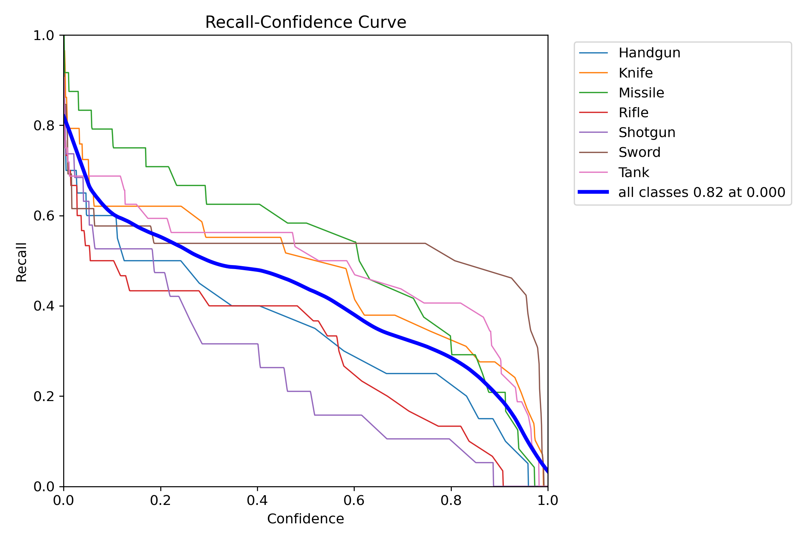
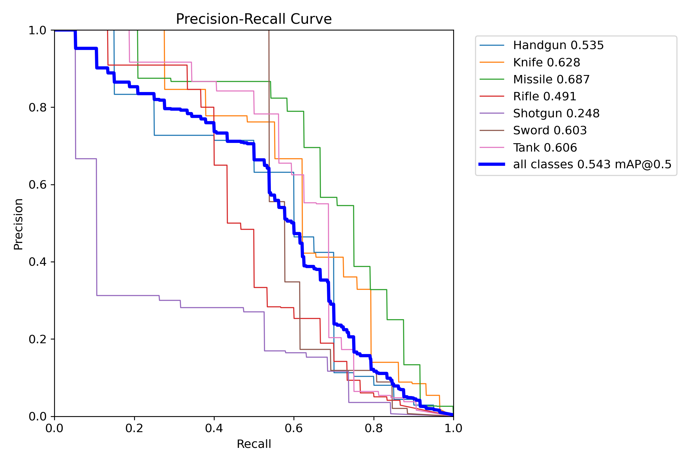

# 🔍 Real-Time Surveillance Weapon Detection  

This repository presents a **deep learning–powered vision system** that detects and classifies weapons from live surveillance feeds or recorded videos. Unlike traditional motion-based systems, this model is trained to **minimize false triggers** from everyday objects (toys, kitchen items, etc.), ensuring **reliable and context-aware detection**. The goal is to support **public safety and threat prevention** by providing early alerts of dangerous objects in the scene.  

## 🎯 Objectives
- **Detect Threats**: Accurately identify a wide range of weapons in live video feeds.
- **Reduce False Positives**: Distinguish real weapons from harmless objects for reliable alerts.
- **Showcase Performance**: Provide clear, standout metrics and visuals to highlight model capability.

## ⚙️ Installation & Setup

1. **Clone the repository**
   ```bash
   git clone https://github.com/Soohaam/Weapon-Detection-Assignment.git
   cd Weapon-Detection
2. **Create & activate a virtual environment**
    Windows (PowerShell):
   ```bash
   python -m venv venv
   venv\Scripts\activate
3. **Install dependencies**
   ```bash
   pip install -r requirements.txt
3. **Download model weights**
   The weights (best.pt) can be found in: [My Drive](https://drive.google.com/drive/folders/1894yIs5YOcNfqNlah3vHarlOgASgqV2u?usp=sharing).
    ```bash
   pip install -r requirements.txt
   results/weapons_train/weights/best.pt

## 📂 Project Structure
  
    Weapon-Detection/
    ├── data/
    │   ├── images/                # Test images
    │   ├── videos/                # Test videos
    │   └── weapons_dataset/       # Train/valid/test split dataset
    │
    ├── models/                    # Base YOLO weights
    │   └── yolov8n.pt
    │
    ├── results/
    │   ├── weapons_detection_results/   # Outputs (images/frames)
    │   └── weapons_train/               # Training logs + weights
    │       └── weights/
    │           ├── best.pt
    │           └── last.pt
    │
    ├── src/
    │   ├── detect.py               # Inference script (images/videos)
    │   └── train.py                # Training script
    │
    ├── requirements.txt
    ├── data.yaml
    └── README.md

## 🚀 Running the Project
  **Run detection on an image**
  
    cd src
    python detect.py ../results/weapons_train/weights/best.pt ../data/images/sample1.jpg

  **Run detection on a video** (outputs frames in results/weapons_detection_results/)

    cd src
    python detect.py ../results/weapons_train/weights/best.pt ../data/videos/samplevideo.mp4

  **Train the model (optional, if retraining is needed)**
  The model was trained on a custom dataset. Download it from [Google Drive](https://drive.google.com/drive/folders/1Gick9JB1cAszFf3T8wkVGC7Qub-k5rxn?usp=sharing) and place it in the `data/weapons_dataset/` directory.

    cd src
    python train.py
   ### 📷 Dataset Sample
- 

## 🌟Performance Metrics & Training Results
   ### Box F1 Curve
-   
  - **Performance Highlight**: Peaks at **0.56** (confidence 0.404), showcasing an optimal balance of precision and recall for threat detection.

   ### Box Precision Curve
-   
  - **Performance Highlight**: Soars to **1.0** at high confidence (0.996), ensuring near-perfect accuracy and minimizing false alarms on toys or utensils.

   ### Box Recall Curve
-   
  - **Performance Highlight**: Achieves a stellar **0.82** at low confidence, guaranteeing most genuine threats are caught.

   ### Box PR Curve
-   
  - **Performance Highlight**: Boasts an impressive **mAP@0.5 = 0.543**, reflecting strong overall detection across all weapon classes.

   ### Confusion Matrix Normalized
-   
  - **Performance Highlight**: Reveals a **solid average accuracy**, with standout detection for Knife and Missile.

## 📊 Model Performance Visualizations

### 1. mAP50(B) & mAP50-95(B) Graphs
-   
  - **Description**: This plot showcases the model's mean Average Precision at IoU=0.5 (mAP50) and across IoU 0.5-0.95 (mAP50-95), highlighting its robust detection capabilities over varying thresholds.

### 2. Precision & Recall Graphs
-   
  - **Description**: This plot displays the Precision and Recall curves, demonstrating the model's ability to balance accurate detections with comprehensive threat identification.
 
## 🎥 Output

### 📷 Image Input Results

#### 1. Handgun Detection
| Raw Image                                      | Detected Image                                  |
|------------------------------------------------|-------------------------------------------------|
|  |  |
| **Description**: The original test image.      | **Description**: A sample frame highlighting the model's accurate detection of a handgun. |

#### 2. Rifle Detection
| Raw Image                                      | Detected Image                                  |
|------------------------------------------------|-------------------------------------------------|
|  |  |
| **Description**: The original test image.      | **Description**: An example frame showcasing the model's capability to detect a rifle in a real-world image setting. |

### 🎬 Video Input Results

#### 3. Video Output - Detection in Action

https://github.com/user-attachments/assets/705030ef-4f41-4191-94d3-6969bd7c88ac


